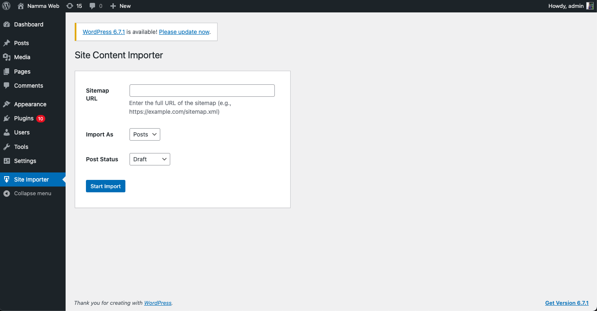

# WordPress Site Content Importer

A powerful WordPress plugin that allows you to import content from any website into WordPress posts or pages using their sitemap XML.

## Features

- Import content from any website that has a sitemap
- Support for both standard sitemaps and sitemap index files
- Import content as either posts or pages
- Choose between draft or published status for imported content
- Clean content import with automatic removal of unwanted elements (scripts, styles, headers, footers)
- Progress indicator during import process
- Source URL tracking for imported content
- Simple and intuitive admin interface
- Security features including nonce verification and capability checking

## Installation

1. Clone this repository or download the ZIP file
2. Upload the plugin folder to the `/wp-content/plugins/` directory
3. Activate the plugin through the 'Plugins' menu in WordPress
4. Access the importer via 'Site Importer' in the WordPress admin menu

## Usage

1. Go to 'Site Importer' in the WordPress admin menu
2. Enter the sitemap URL of the website you want to import from
3. Choose whether to import content as posts or pages
4. Select the post status (draft or published)
5. Click 'Start Import' and wait for the process to complete
6. Review the imported content in your WordPress posts/pages section

## Requirements

- WordPress 5.0 or higher
- PHP 7.2 or higher
- PHP DOM extension enabled
- Permission to make external HTTP requests

## Screenshots

1. Admin Interface
   

## Known Limitations

- Very large sitemaps might require increased PHP memory limit
- Some websites may block automated requests
- Complex JavaScript-rendered content may not import correctly
- Image import is limited to publicly accessible images

## Contributing

Contributions are welcome! Please feel free to submit a Pull Request. For major changes, please open an issue first to discuss what you would like to change.

1. Fork the repository
2. Create your feature branch (`git checkout -b feature/AmazingFeature`)
3. Commit your changes (`git commit -m 'Add some AmazingFeature'`)
4. Push to the branch (`git push origin feature/AmazingFeature`)
5. Open a Pull Request

## License

This project is licensed under the GPL v2 or later - see the [LICENSE.md](LICENSE.md) file for details.

## Credits

Developed by [Selvakumar Duraipandian]

## Support

For support, please create an issue in the GitHub repository or contact [your contact information].

## Roadmap

Future features under consideration:

- Custom post type support
- Category and tag importing
- Custom field mapping
- Image downloading and media library integration
- Batch processing for large sites
- Import scheduling
- Custom content filters
- Support for non-XML sitemaps
- Import preview functionality

## Changelog

### 1.0.0
- Initial release
- Basic sitemap parsing and content import
- Support for posts and pages
- Progress indicator
- Basic content cleaning

## FAQ

**Q: Can I import content from any website?**
A: Yes, as long as the website has a publicly accessible sitemap and allows content scraping.

**Q: Will this plugin import images?**
A: Currently, the plugin only imports images that are publicly accessible via URLs. Local image downloading is planned for a future release.

**Q: Can I modify the imported content?**
A: Yes, all imported content can be edited just like any other WordPress post or page.

**Q: How can I track which content was imported?**
A: The plugin stores the source URL as post meta for each imported item.

## Privacy Notice

This plugin does not collect any personal data. However, it does make requests to external websites during the import process. Please ensure you have the necessary permissions to import content from the source website.